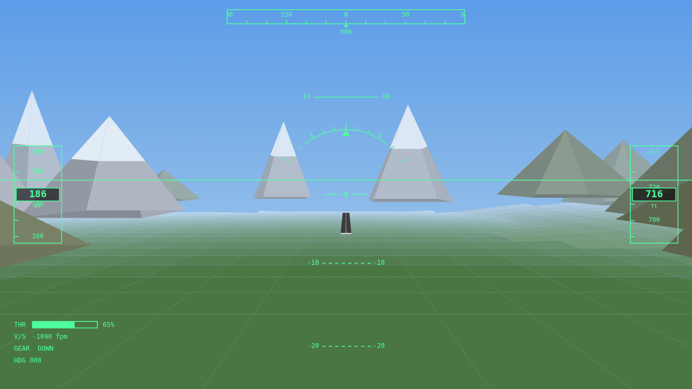

# ✈ FlightSim

A complete 3D flight simulator game that runs in any modern browser — built
from scratch in plain JavaScript. No game engine, no libraries, no build step,
no assets, no network. Just open the file and fly.

 



## Play

Open **`index.html`** in a browser and click **Start Flight**.

That's it — everything (the 3D renderer, the flight physics, the terrain and the
head-up display) is hand-written and self-contained in `main.js`.

You spawn on a descending approach a few kilometres north of the airfield. Your
goal: fly around, and grease a landing back on the runway.

## Controls

| Key | Action |
| --- | --- |
| **W** / **S** | Pitch — **W** = nose up, **S** = nose down |
| **A** / **D** | Roll left / right |
| **Q** / **E** | Rudder (yaw) left / right |
| **Shift** / **Ctrl** | Throttle up / down |
| **G** | Toggle landing gear |
| **V** | Switch camera (cockpit ↔ chase) |
| **R** | Reset / respawn |
| **P** | Pause |

## How to land

1. Line up with the runway (heading **360 / N**) and descend gently.
2. Keep the airspeed above the **stall** speed — watch for the red `STALL`
   warning.
3. Aim for a sink rate softer than about **-600 fpm**, wings level, gear down.
4. Touch the tarmac, cut the throttle (**Ctrl**), and roll to a stop.

Hit the ground too hard, too fast, banked, or off the runway and you'll crash —
press **R** to try again.

## What's under the hood

Everything is written from first principles:

- **3D engine** — a hand-rolled perspective camera with an orientation matrix
  built from yaw/pitch/roll, world→camera transform, near-plane polygon
  clipping, and a painter's-algorithm rasteriser on a plain 2D canvas.
- **Procedural world** — deterministic rolling terrain (sine-field height map)
  coloured by elevation, scattered snow-capped mountains, distance fog, slope
  shading, and a striped runway.
- **Flight model** — thrust/drag/gravity along the flight path, angle-of-attack
  lift with a realistic stall, speed-dependent control authority, and
  coordinated banked turns.
- **Glass-cockpit HUD** — attitude indicator with pitch ladder and roll pointer,
  airspeed and altitude tapes, a heading tape, throttle/vertical-speed/gear
  readouts, and a stall warning.

## Project layout

```
index.html   markup + start menu
style.css    menu / HUD overlay styling
main.js      the entire simulator (engine + physics + world + HUD)
test/        headless physics & render smoke tests (Node, no deps)
```

## Tests

The physics and renderer run headlessly under Node (with the browser APIs
stubbed) so they can be checked without a display:

```bash
npm test
```

This drives the real `stepPhysics()` through climb, descent, banked-turn,
glide, cruise and crash scenarios and asserts the aircraft behaves correctly.

## License

MIT
